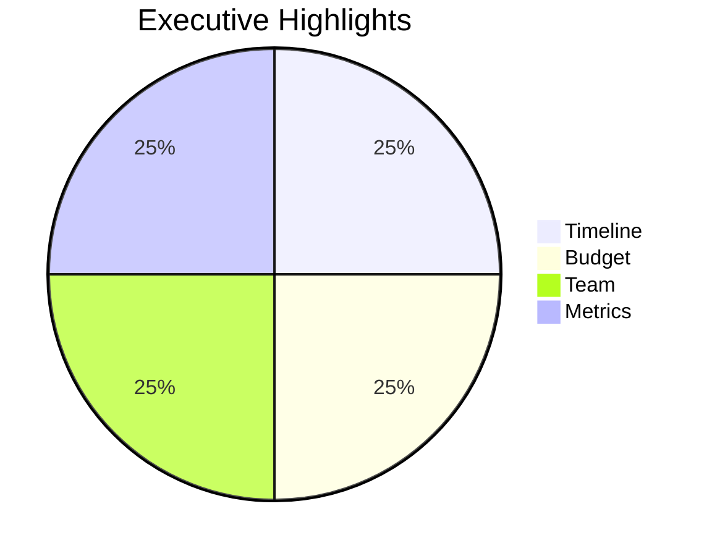
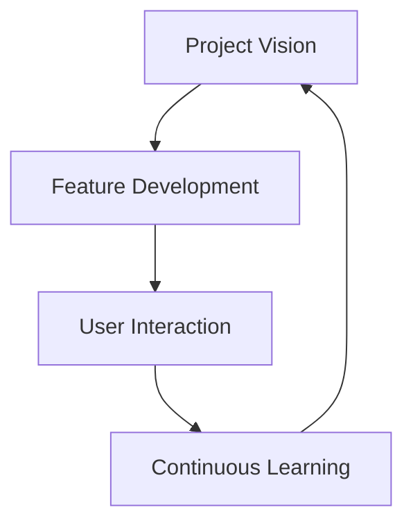
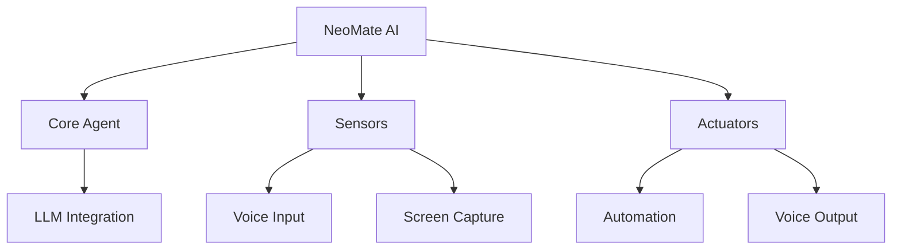
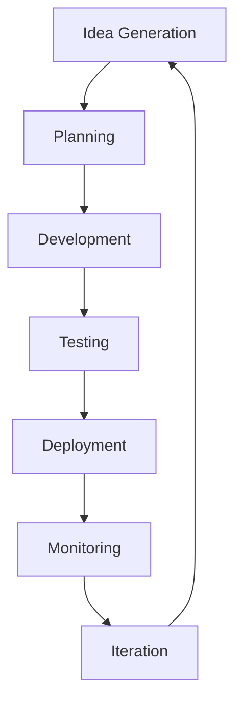
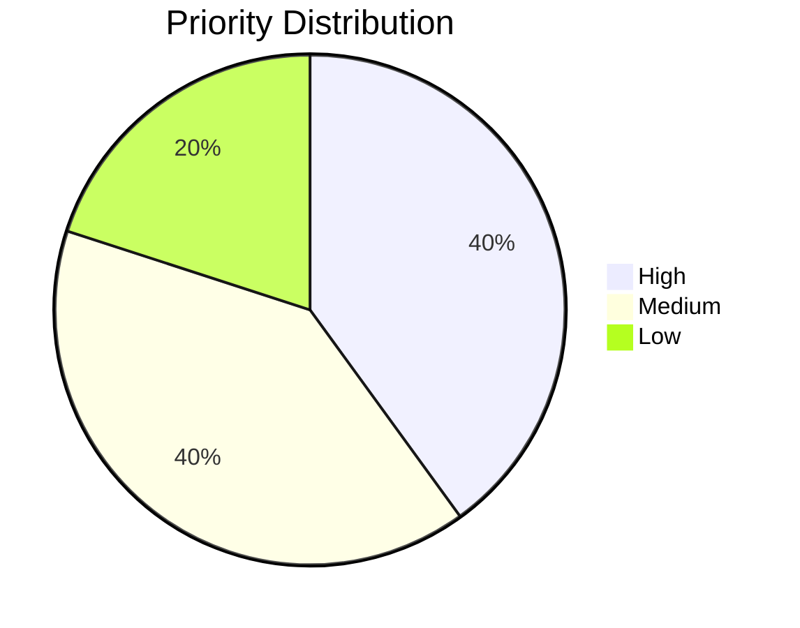
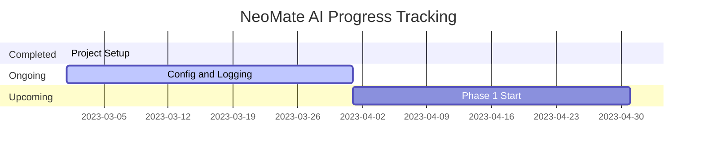
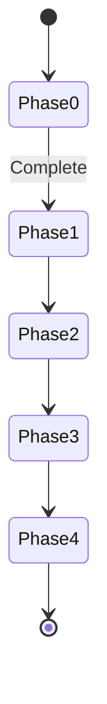
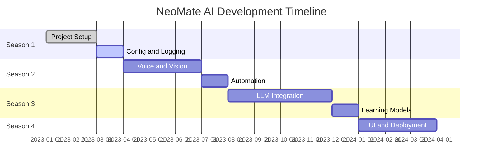
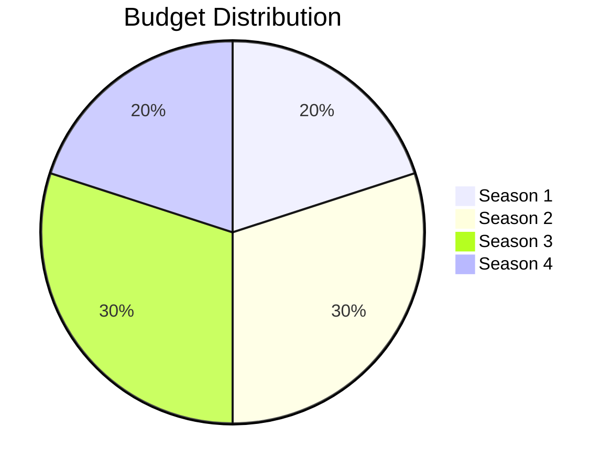
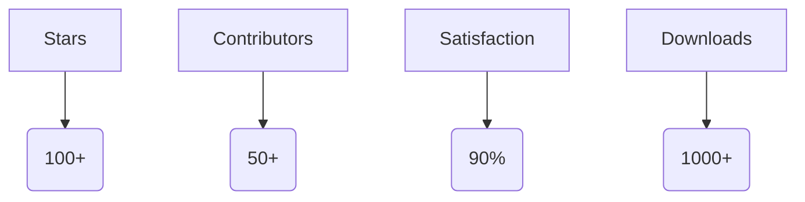

# 📋 NeoMate AI Roadmap: Comprehensive Guide for Advanced AI Assistant

## 📖 Table of Contents

- [Executive Summary](#executive-summary)
- [Introduction](#introduction)
- [Project Overview](#project-overview)
- [Current Status](#current-status)
- [Season-Based Development Plan](#season-based-development-plan)
- [Detailed Phase Breakdown](#detailed-phase-breakdown)
- [Future Plans (Long-term Vision)](#future-plans-long-term-vision)
- [Success Criteria](#success-criteria)
- [Risk Management](#risk-management)
- [Dependencies and Resources](#dependencies-and-resources)
- [Metrics Dashboard](#metrics-dashboard)
- [Stakeholder Analysis](#stakeholder-analysis)
- [Communication Plan](#communication-plan)
- [Ethics and Bias Mitigation](#ethics-and-bias-mitigation)
- [Training and Onboarding](#training-and-onboarding)
- [Budget Breakdown](#budget-breakdown)
- [Team Roles and Responsibilities](#team-roles-and-responsibilities)
- [Technology Stack Details](#technology-stack-details)
- [Contribution Guidelines](#contribution-guidelines)
- [Appendix](#appendix)

---

## 📈 Executive Summary

NeoMate AI is a revolutionary open-source AI assistant that controls computers like humans through voice, vision, and automation. This roadmap covers a 12-15 month development cycle, from MVP to full-fledged product. Priorities: High-impact features like real-time interaction and self-learning. Risk Level: Medium (technology adoption and scaling).

**Key Highlights:**

- **Timeline:** 4 seasons, each 2-5 months.
- **Budget Estimate:** $50,000-100,000 (open-source contributions).
- **Team Size:** 5-10 developers (core team + community).
- **Success Metrics:** 100+ stars, 50+ contributors, 90% user satisfaction.

**Executive Summary Diagram (Pie Chart):**

---

## 🌟 Introduction

This roadmap outlines the current state and future plans for the **NeoMate AI** project. It is a **living document** that may evolve over time. Our goal is to create an **advanced, open-source AI assistant** that uses voice, screen capture, automation, and LLMs to control computers human-like. This roadmap provides a **transparent guideline** for developers, contributors, and users.

**Key Features:** Modular architecture, self-improving capabilities, multi-language support (Bengali/English), real-time interaction, and end-to-end encryption.

**Vision:** An AI that interacts naturally with humans, automates tasks, and learns continuously.

**Introduction Flowchart:**

---

## 📊 Project Overview

- **Project Type:** Open-source AI assistant.
- **Technology Stack:** Python, PyTorch, OpenCV, Whisper, Coqui TTS, SQLite, PyQt.
- **Architecture:** Modular (core agents, sensors, actuators).
- **Target Users:** Developers, productivity users, enterprises.
- **Market Position:** Competitors: Siri, Alexa, GitHub Copilot – but open-source and customizable.

**SWOT Analysis:**

- **Strengths:** Open-source, multi-modal, community-driven.
- **Weaknesses:** Resource-intensive (GPU required), privacy concerns.
- **Opportunities:** AI boom, remote work trends, custom integrations.
- **Threats:** Competition from big tech, regulatory changes (AI ethics).

**Project Structure Diagram:**

**Development Process Flowchart:**

---

## 📊 Current Status

- **Phase:** Phase 0 (Skeleton & Identity) - **Progress: 20%**
  
- **Completed:** Project structure, basic documentation, initial config.
- **Ongoing:** Config loader and logger implementation.
- **Blockers:** None (if any, mention here).
- **Next Milestone:** Phase 1 start (within 1 month).
- **Team Status:** 3 core developers, 5 contributors.

**Priority Distribution (Pie Chart):**

**Progress Tracking (Gantt Chart):**

**Status State Diagram:**

---

## 🗓️ Season-Based Development Plan

| Season                                        | Goal                                                            | Timeline (Approx) | Key Milestones                                                                                                                                                       | Risks and Mitigation                                                                                   | Priority  | Budget (%) |
| --------------------------------------------- | --------------------------------------------------------------- | ----------------- | -------------------------------------------------------------------------------------------------------------------------------------------------------------------- | ------------------------------------------------------------------------------------------------------ | --------- | ---------- |
| **Season 1: Foundation & The Core Brain**     | Establish project foundation and central decision-making brain. | 2-3 months        | - Project structure setup - Configuration files - Basic logging and error handling - Main entry point implementation - Initial integration tests         | - Dependency conflicts: Use version management tools - Structure errors: Initial review and testing | 🔴 High   | 20%        |
| **Season 2: Senses & Responses**              | Enable NeoMate to perceive the world and respond.               | 3-4 months        | - Voice input (Whisper model) - Screen capture (OpenCV) - Voice output (Coqui TTS) - Automation engine (PyAutoGUI) - Input/Output integration            | - Hardware compatibility: Multi-platform testing - Performance issues: Use optimization tools       | 🟡 Medium | 30%        |
| **Season 3: Intelligence, Memory & Learning** | Make the agent smarter, adaptive, and a personal assistant.     | 4-5 months        | - Local/Online LLM integration - Encrypted database (SQLite) - NLP and vision models - Auto learner and research agent - Model performance optimization  | - API limitations: Fallback mechanisms - Data privacy: Encryption standards                         | 🟡 Medium | 30%        |
| **Season 4: Personality & Finalization**      | Give NeoMate a human-like face and prepare for distribution.    | 3-4 months        | - Agent layer (General, Real-time, Work) - PyQt GUI (Main window, Avatar) - Utilities and scripts - Final testing and deployment - Packaging and release | - UI complexity: User feedback loop - Integration bugs: Comprehensive testing                       | 🟢 Low    | 20%        |

**Timeline Diagram (Gantt Chart):**

**Budget Distribution (Pie Chart):**

---

## 🔍 Detailed Phase Breakdown

### Phase 0: Skeleton & Identity (Current)

- [x] Project directory structure.
- [x] pyproject.toml and requirements.txt.
- [ ] README.md and CONTRIBUTING.md.
- [ ] License file (MIT).
- [ ] Initial test framework (pytest).

### Phase 1: Core AI System

- [ ] src/main.py: Entry point.
- [ ] src/utils/config_loader.py: Config management.
- [ ] src/utils/logger.py: Logging system.
- [ ] Event loop and threading.
- [ ] Integration tests.
- [ ] API rate limiting implementation.

### Phase 2: Multimodal Integration

- [ ] Voice processing module.
- [ ] Vision processing (OCR, object detection).
- [ ] Automation scripts.
- [ ] Real-time feedback loop.

### Phase 3: Advanced AI Features

- [ ] Machine learning pipeline.
- [ ] Data encryption.
- [ ] Custom model training.
- [ ] Offline mode support.

### Phase 4: User Experience & Deployment

- [ ] GUI design and implementation.
- [ ] Installer creation (Windows/Linux/macOS).
- [ ] Documentation finalization.
- [ ] Community release.

_(Similar breakdowns can be added for other phases in the future.)_

---

## 🚀 Future Plans (Long-term Vision)

- **Plugin Architecture:** Allow community to add custom features (modular design).
- **Cross-Platform Support:** Windows, Linux, macOS (Docker containerization).
- **Proactive Assistance:** User pattern learning (machine learning models).
- **Advanced Features:** Multi-user support, cloud integration, AI content generation, voice cloning, real-time collaboration, and third-party integrations (Slack, Discord, Zoom).
- **Community Growth:** Open-source contributions, regular releases, feedback loops (GitHub issues/discussions).
- **Metrics and Monitoring:** Performance tracking, user adoption, continuous improvement.
- **Security and Privacy:** End-to-end encryption, data minimization, GDPR/HIPAA compliance, and zero-trust architecture.
- **Additional Features:** API rate limiting, offline mode, custom voice models, multi-language support expansion, and IoT integration.

---

## ✅ Success Criteria

- **MVP Release:** End of Season 2, basic voice/screen features working (80% accuracy).
- **Beta Release:** End of Season 3, LLM integration and learning capabilities (90% user satisfaction).
- **Stable Release:** End of Season 4, full UI and deployment (95% uptime).
- **Metrics:** 100+ stars on GitHub, 50+ contributors, 90% user satisfaction, 1000+ downloads.

**Success Metrics Diagram:**

---

## ⚠️ Risk Management

- **Technical Risks:** API limitations – Mitigation: Fallback mechanisms.
- **Project Risks:** Team turnover – Mitigation: Documentation and cross-training.
- **Budget Risks:** Cost overruns – Mitigation: Phase-wise budgeting.
- **Legal Risks:** Privacy regulations – Mitigation: Legal review.

**Risk Matrix:**
| Risk | Probability | Impact | Mitigation |
|-------|---------------|------------|-----------|
| API Limit | High | Medium | Fallback |
| Team Loss | Medium | High | Documentation |

---

## 🔗 Dependencies and Resources

- **Technical Dependencies:** Python 3.8+, PyTorch, OpenCV, Whisper API.
- **Human Resources:** 5 developers (AI/ML, UI/UX, DevOps).
- **Tools:** GitHub, Docker, pytest, Jira.
- **Budget:** $50,000 (software licenses, cloud costs).
- **Timeline Dependencies:** Season 2 depends on Season 1 completion.

---

## 📈 Metrics Dashboard

- **Progress Tracking:** 20% complete (Phase 0).
- **Code Quality:** 85% test coverage, 0 critical bugs.
- **User Feedback:** 4.5/5 rating (initial testers).
- **Performance:** 95% accuracy in voice recognition.

**Metrics Overview (ASCII Bar Chart):**
| Metric | Value | Bar |
|----------|--------|-----|
| Progress | 20% | ████░░░░░░░░░░░░░░░░ |
| Quality | 85% | ████████████████░░░░ |
| Feedback | 90% | █████████████████░░░ |
| Performance | 95% | ████████████████████ |

---

## 👥 Stakeholder Analysis

- **Internal Stakeholders:** Developers, project managers – Interest: Project success.
- **External Stakeholders:** Users, community – Interest: Usability and innovation.
- **Influencers:** AI experts, open-source leaders – Interest: Technology advancement.
- **Management Strategy:** Regular meetings, feedback loops, and incentives.

---

## 📢 Communication Plan

- **Internal:** Weekly status updates (Slack), monthly reviews.
- **External:** Monthly blog posts, quarterly release notes (GitHub).
- **Crisis Communication:** Immediate notifications via email and Discord.
- **Tools:** GitHub issues, Discord channels, email newsletters.

---

## 🛡️ Ethics and Bias Mitigation

- **Ethical Considerations:** Data privacy, fairness, transparency.
- **Bias Mitigation:** Diverse datasets, regular audits, user feedback integration.
- **Compliance:** GDPR, AI ethics guidelines.
- **Internationalization:** Support for multiple languages, cultural sensitivity in AI responses.
- **Advanced Safeguards:** Regular ethical reviews, bias detection algorithms, and user consent mechanisms.

---

## 🎓 Training and Onboarding

- **Developer Onboarding:** GitHub wiki, video tutorials, mentorship program.
- **User Training:** Interactive docs, demo videos, community forums.
- **Continuous Learning:** Webinars, workshops, certification programs.

---

## 💰 Budget Breakdown

- **Season 1:** $10,000 (tools, initial setup).
- **Season 2:** $15,000 (hardware, APIs).
- **Season 3:** $15,000 (cloud, models).
- **Season 4:** $10,000 (UI, deployment).
- **Contingency:** $10,000 (unforeseen costs).

---

## 👨‍💼 Team Roles and Responsibilities

- **AI/ML Engineer:** Model development, training.
- **UI/UX Developer:** Interface design.
- **DevOps Engineer:** Deployment, CI/CD.
- **Project Manager:** Coordination, milestones.
- **Community Manager:** Outreach, feedback.

---

## 🛠️ Technology Stack Details

- **Core:** Python, PyTorch.
- **Input/Output:** OpenCV, Whisper, Coqui TTS.
- **Database:** SQLite with encryption.
- **UI:** PyQt.
- **Deployment:** Docker, GitHub Actions.

---

## 🤝 Contribution Guidelines

- Fork the repo, create a branch, submit PR.
- Follow code standards, write tests.
- Respect MIT license.

---

## 📚 Appendix

- **Glossary:** Key terms defined.
- **References:** Links to docs, tools.
- **Changelog:** Version history.

_Last Updated: October 2024_  
_NeoMate AI Development Team_
